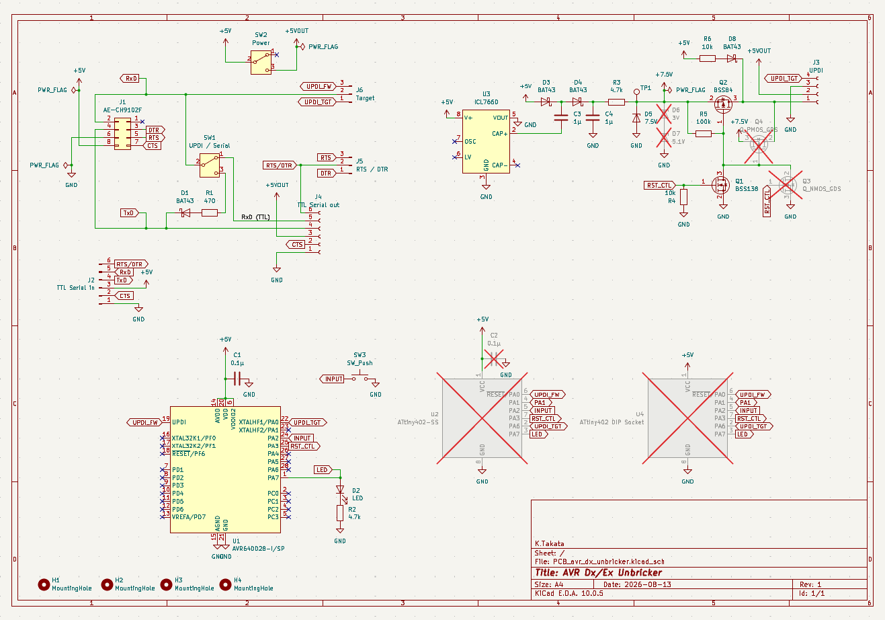
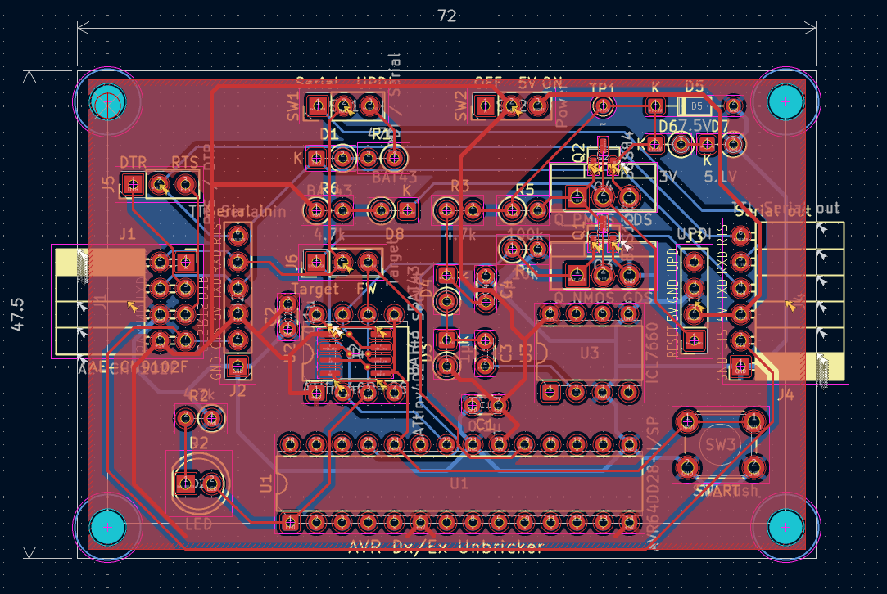
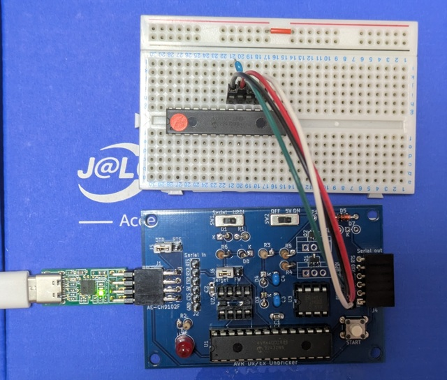

[English](README.md) | [日本語](README.ja.md)

# AVR Dx/Ex Unbricker

## 3-Line Summary

* A 7.5 V HV-capable UPDI unbricker for AVR Dx/Ex series devices.
* It restores normal UPDI programming by injecting an HV pulse into devices where UPDI was disabled.
* It does not support 12 V HV programming for ATtiny series devices.

## Overview

This is a UPDI (Unified Program and Debug Interface) programmer that supports 7.5 V high-voltage (HV) programming for AVR Dx/Ex series devices. (It does not support 12 V HV programming for ATtiny series devices.)  
If UPDI pin settings were changed intentionally or accidentally and a normal UPDI programmer can no longer write to the device, this tool injects an HV pulse (7.5 V) to recover UPDI access.

Use it with either the [AE-CH9102F-TYPEC-BO CH9102F USB-Serial converter kit](https://akizukidenshi.com/catalog/g/g129505/) from [Akizuki Denshi](https://akizukidenshi.com/), or a common 6-pin serial module.

The UPDI section of the circuit follows [SerialUPDI](https://github.com/SpenceKonde/AVR-Guidance/blob/master/UPDI/jtag2updi.md).


## Supported Scope

| Item | Status | Notes |
|------|--------|-------|
| 7.5 V HV UPDI for AVR Dx/Ex | Supported | HV pulse is applied to RESET pin |
| 12 V HV UPDI for ATtiny | Not supported | Method that applies 12 V pulse to UPDI pin |
| Normal UPDI programming | Supported | Use SerialUPDI as programmer |
| Verified device | AVR64DD28 | As of this README revision |


## Software Used

* KiCad 10.0
* Arduino IDE 2.3.10
  - [DxCore](https://github.com/SpenceKonde/DxCore) 1.5.11
  - [megaTinyCore](https://github.com/SpenceKonde/megaTinyCore) 2.6.11


## Quick Start

For first-time use only, write firmware to the onboard MCU (U1/U2) first.

1. Populate either U1 or U2.
2. Connect a host-side serial module to J1 or J2.
3. Set J6 to **FW** and SW1 to **UPDI**.
4. In Arduino IDE, open `src/sketch_avr_dx_unbricker/sketch_avr_dx_unbricker.ino`, then select board/chip based on whether U1 or U2 is populated.
5. Set programmer to SerialUPDI and write firmware to U1/U2.
6. After flashing, switch J6 back to **Target**.
7. Connect the target to J3, and set SW2 as needed. (Set ON if this board should power the target.)
8. Press START to inject the HV pulse.
9. In Arduino IDE, keep programmer set to SerialUPDI and perform normal programming.

See "Usage" for full procedures.


## Safety Notes

* A 7.5 V HV pulse is output on RESET. Verify target circuit voltage tolerance and protection first.
* If the target is externally powered, set SW2 to OFF to avoid double-powering.
* During HV operation, leaving J4 disconnected is recommended.
* For initial validation, test with a bare chip or minimal setup rather than a full target board when possible.


## Schematic

[](images/schema.pdf)


## PCB Pattern




## Bill of Materials

| Reference | Qty | Value | Description |
|-----------|-----|-------|-------------|
| C1,C2     | 2   | 0.1 μF | |
| C3,C4     | 2   | 1 μF   | For charge pump (\*1) |
| D1,D3,D4,D8 | 4 | [BAT43](https://akizukidenshi.com/catalog/g/g113907/) | Suitable Schottky barrier diode |
| D2        | 1   | LED   | 5 mm |
| D5        | 1   | [1N4737A](https://www.sengoku.co.jp/mod/sgk_cart/detail.php?code=EEHD-0FMV) | 7.5 V Zener diode (\*2) |
| D6        | 1   | Optional | Zener diode (\*2) |
| D7        | 1   | Optional | Zener diode (\*2) |
| J1        | 1   |       | Right-angle pin socket 2x4 (\*3), for AE-CH9102F-TYPEC-BO |
| J2        | 1   |       | Pin header 1x6, TTL serial input |
| J3        | 1   |       | Pin socket 1x4, UPDI connection |
| J4        | 1   |       | [Right-angle pin socket 1x6](https://akizukidenshi.com/catalog/g/g109862/), TTL serial output |
| J5        | 1   |       | Pin header 1x3, RTS/DTR selection |
| J6        | 1   |       | Pin header 1x3, destination select |
| Q1        | 1   | [BSS138](https://akizukidenshi.com/catalog/g/g104232/) | Nch MOSFET |
| Q2        | 1   | [BSS84](https://akizukidenshi.com/catalog/g/g104269/) | Pch MOSFET |
| R1        | 1   | 470 Ω | Yellow-Violet-Brown-Gold, 1/4W size |
| R2        | 1   | 4.7 kΩ | Yellow-Violet-Red-Gold, 1/4W size, adjust for LED as needed |
| R3        | 1   | 4.7 kΩ | Yellow-Violet-Red-Gold, 1/4W size |
| R4,R6     | 2   | 10 kΩ | Brown-Black-Orange-Gold, 1/4W size |
| R5        | 1   | 100 kΩ | Brown-Black-Yellow-Gold, 1/4W size |
| SW1,SW2   | 2   | [SS-12D00G3](https://akizukidenshi.com/catalog/g/g115707/) | PCB slide switch, SPDT |
| SW3       | 1   |       | Push switch |
| U1        | 1   | [AVR64DD28-I/SP](https://akizukidenshi.com/catalog/g/g118314/) | (\*4) |
| U2        | 1   | [ATtiny402-SS](https://akizukidenshi.com/catalog/g/g130009/) | (\*4)(\*5) |
| U3        | 1   | [TJ7660](https://akizukidenshi.com/catalog/g/g112017/) | ICL7660 compatible |

(\*1) Datasheet recommends 10 μF, but current draw is minimal, so 1 μF is sufficient.  
(\*2) Use D5 alone, or D6 + D7 in combination. Adjust so TP1 becomes 7.5 V (at least Vdd + 2.0 V and at most 8.5 V). For example, 3.0 V + 5.1 V is also possible.  
(\*3) For example, use and trim [Right-angle pin socket 2x6](https://akizukidenshi.com/catalog/g/g116795/) (one piece) or [Right-angle pin socket 2x15](https://akizukidenshi.com/catalog/g/g113419/) (three pieces).  
(\*4) Use either U1 or U2.  
(\*5) If using U2, either mount ATtiny402 directly or mount it via an [SOP8 conversion board](https://akizukidenshi.com/catalog/g/g105154).


## About UPDI HV Programming

UPDI (Unified Program and Debug Interface) is a programming interface used by relatively recent AVR devices.

UPDI normally uses a dedicated pin, but in some devices that pin can be changed to GPIO by fuse settings. If UPDI is disabled, normal UPDI programming is no longer possible until UPDI is re-enabled by a special method. That method is high-voltage (HV) programming.

There are two HV programming methods: one for ATtiny series that applies a 12 V pulse to the UPDI pin, and one for AVR Dx/Ex series that applies a 7.5 V pulse to the RESET pin.

1. ATtiny series:  
  Apply a 12 V pulse to UPDI pin within 8.8 ms after power-on reset (POR).  
   If the pulse is not applied within the timing window, it may interfere with pin function.
2. AVR Dx/Ex series:  
  Apply a 7.5 V pulse to RESET pin, then send the NVMPROG key within 65 ms.  
   If NVMPROG key transmission is not completed within the timing window, the device is automatically reset.  
   Unlike ATtiny, there is a dedicated RESET pin that cannot be used as output, so there is no POR-to-HV timing constraint.

AVR Dx/Ex Unbricker supports only AVR Dx/Ex HV programming and performs both the 7.5 V pulse and NVMPROG key transmission.

**References:**

* [ATtiny202/204/402/404/406 Data Sheet](https://ww1.microchip.com/downloads/aemDocuments/documents/MCU08/ProductDocuments/DataSheets/ATtiny202-204-402-404-406-DataSheet-DS40002318A.pdf) [PDF]  
  See "30. UPDI - Unified Program and Debug Interface" and "33. Electrical Characteristics" (33.18. UPDI Timing).
* [AVR64DD32/28 Datasheet](https://ww1.microchip.com/downloads/aemDocuments/documents/MCU08/ProductDocuments/DataSheets/AVR64DD32-28-Complete-DataSheet-DS40002315.pdf) [PDF]  
  See "34. UPDI - Unified Program and Debug Interface" and "36. Electrical Characteristics" (36.18. UPDI).


## Verified Device

* AVR64DD28


## Usage

### Connections

Connect J1 to AE-CH9102F-TYPEC-BO. On AE-CH9102F-TYPEC-BO, install a right-angle 2x4 header on the board top side instead of the included straight header.
Alternatively, connect a common 6-pin TTL serial module to J2. (Use either J1 or J2, not both.)

J3 uses the same UPDI v2 connector as the [AVR Programming Adapter](https://www.microchip.com/en-us/development-tool/AC31S18A).

| Pin | Function  | Color |
|-----|-----------|-------|
| 1   | RESET     | White |
| 2   | VDD (5 V) | Red   |
| 3   | GND       | Black |
| 4   | UPDI      | Green |

Because a 7.5 V pulse is output from RESET, the connected target circuit must be designed with that in mind.

J4 is a common 6-pin TTL serial connector. When J1 is used, pin 6 on J4 can be switched between RTS and DTR by placing a jumper on J5. (When J2 is used, pin 6 on J4 is directly connected to pin 6 on J2, so behavior depends on the serial module.)

| Pin | Function   | Color  |
|-----|------------|--------|
| 1   | GND        | Black  |
| 2   | CTS        | Brown  |
| 3   | VDD (5 V)  | Red    |
| 4   | TxD        | Orange |
| 5   | RxD        | Yellow |
| 6   | RTS / DTR  | Green  |

SW1 switches between UPDI mode and serial communication mode. Move it toward UPDI silk for UPDI mode (J3), and toward Serial silk for serial mode (J4).

SW2 selects whether this adapter supplies 5 V. Move it toward ON silk to supply 5 V, and toward OFF silk to disable supply. If the target MCU is already powered through another path, set OFF.


### Firmware Flashing

To flash firmware into U1 or U2, use the following setup.

| Part | Setting / Connection |
|------|----------------------|
| U1/U2 | Populate either one |
| SW1  | **UPDI** |
| SW2  | Optional |
| J1/J2 | Connect either one |
| J3   | Not connected |
| J4   | Not connected |
| J5   | Optional |
| J6   | **FW** |

In Arduino IDE, open the sketch under `src`.  
Select board and chip based on whether U1 or U2 is populated.

| Part | Board | Chip |
|------|-------|------|
| U1 | DxCore -> AVR DD-series (no bootloader) | AVR64DD28 |
| U2 | megaTinyCore -> ATtiny412/402/212/202 | ATtiny402 |

Set programmer to SerialUPDI and upload firmware.


### UPDI Programming

#### Normal Mode

Use the following setup.

| Part | Setting / Connection |
|------|----------------------|
| SW1  | **UPDI** |
| SW2  | Usually ON |
| J1/J2 | Connect either one |
| J3   | Connect target |
| J4   | Usually not connected |
| J5   | Optional |
| J6   | **Target** |

SW2 is usually ON, but set OFF if the target is powered from another source.  
J4 is usually left disconnected, but it may remain connected.

In Arduino IDE, set programmer to SerialUPDI and program as usual.


#### HV Programming

Use the following setup.

| Part | Setting / Connection |
|------|----------------------|
| SW1  | **UPDI** |
| SW2  | Usually ON |
| J1/J2 | Connect either one |
| J3   | Connect target |
| J4   | Not connected |
| J5   | Optional |
| J6   | **Target** |

SW2 is usually ON, but set OFF if the target is powered from another source.  
Using J3 with a full target board is fine if the board tolerates HV, but connecting a bare chip is safer.  
Keeping J4 disconnected is recommended.

With this connection, press START. The 7.5 V pulse and NVMPROG key transmission are performed, and UPDI is re-enabled. After that, use normal Arduino IDE write steps as usual.


### Serial Communication

Use the following setup.

| Part | Setting / Connection |
|------|----------------------|
| SW1  | **Serial** |
| SW2  | Usually ON |
| J1/J2 | Connect either one |
| J3   | Usually not connected |
| J4   | Connect target |
| J5   | Select as needed |
| J6   | Optional |

J3 is usually left disconnected, but it may remain connected.  
When J1 is used, pin 6 on J4 can be switched between RTS and DTR by placing a jumper on J5.


## Troubleshooting

### Cannot Program Even After HV

* Check that J6 is set to **Target**.
* Check that SW1 is set to **UPDI**.
* Check that programmer is set to SerialUPDI.
* After pressing START, do not wait too long before starting the write operation.

### Target Does Not Boot or Is Unstable

* Check SW2 setting and ensure there is no duplicate power source.
* Check that GND is shared properly.
* Re-check J3 wiring direction and pin assignment.

### Concerned About HV Voltage

* Adjust D5 or D6+D7 so TP1 is around 7.5 V (at least Vdd + 2.0 V and at most 8.5 V).
* For first-time validation, test on a bare chip or minimal setup before connecting a full target system.


## Critical Issues in DxCore 1.6.2

As of August 2026, the latest release of [DxCore](https://github.com/SpenceKonde/DxCore), version 1.6.2, has critical issues that make AVR DD series devices unusable.
There are two issues: one causes upload failures with an error, and the other applies an incorrect fuse setting that can disable the UPDI pin.

* [On 1.6.2 upload to AVR64DD14 fails with prog.py: error: unrecognized arguments · Issue #629 · SpenceKonde/DxCore](https://github.com/SpenceKonde/DxCore/issues/629)
* [Add missing zero-bit in SYSCFG0 for DD-chips by felias-fogg · Pull Request #638 · SpenceKonde/DxCore](https://github.com/SpenceKonde/DxCore/pull/638)

If you fix only the first issue and proceed with writing, the second issue can still disable UPDI programming. This project was created specifically to recover from that situation.

If both issues above are fixed, DxCore 1.6.2 can be used normally with AVR DD series devices.

On Windows, go to `C:\Users\<USERNAME>\AppData\Local\Arduino15\packages\DxCore\hardware\megaavr\1.6.2` and apply the following changes to `boards.txt`.

```diff
--- boards.txt.orig
+++ boards.txt
@@ -1209,7 +1209,7 @@
 avrdd.bootloader.wdttimeotbits=0000
 avrdd.bootloader.BODCFG=0b{bootloader.bodlevbits}{bootloader.bodmodebits}
 avrdd.bootloader.updipinbit=1
-avrdd.bootloader.SYSCFG0=0b110{bootloader.updipinbit}{bootloader.resetpinbit}0{bootloader.eesavebit}
+avrdd.bootloader.SYSCFG0=0b110{bootloader.updipinbit}{bootloader.resetpinbit}00{bootloader.eesavebit}
 avrdd.bootloader.SYSCFG1=0b000{bootloader.mviobits}{bootloader.sutbits}
 avrdd.bootloader.CODESIZE=0x00
 avrdd.bootloader.BOOTSIZE=0x01
@@ -1227,8 +1227,8 @@
 avrdd.upload.maximum_data_size=0
 # The maximum size and data size attributes are overridden by the selected chip. If you are avoiding specifying that somehow, there is no hope of anything working, so don't do that.
 # Each top-level entry supports at least a dozen parts with varying memory constraints.
-avrdd.program.serupdifuse5="-Ufuse5:w:{bootloader.SYSCFG0}:m"
-avrdd.program.avrdudefuse5=5:{bootloader.SYSCFG0}
+avrdd.program.avrdudefuse5="-Ufuse5:w:{bootloader.SYSCFG0}:m"
+avrdd.program.serupdifuse5=5:{bootloader.SYSCFG0}
 
 
 #----------------------------------------#
```

This fix will be overwritten when DxCore is updated or reinstalled via Boards Manager, so you must reapply it in those cases.

If you need new features in DxCore 1.6.x (for example, AVR DU series support), use this workaround until a fixed release is available. If you do not need those features, using DxCore 1.5.11 is recommended.


## Finished Product

[](images/unbricker.jpg)


## License

CC0


## Related Projects

Links to projects and references related to UPDI HV programming.

### ATtiny-Only

There are many projects for 12 V HV programming. The list below is only a subset. (However, relatively few are designed to apply the HV pulse within the required timing after POR.)

* [todopapa/UPDI_HV_WRITER-w-RESET: This is a new AVR ATTINY series UPDI programmer with HV pulse injection avility on power on reset timing.](https://github.com/todopapa/UPDI_HV_WRITER-w-RESET)
* [DIY Arduino Nano HV UPDI Programmer - Electronics-Lab](https://www.electronics-lab.com/diy-arduino-nano-hv-updi-programmer/)
* [UPDI HVP のための 12V を得る方法の試行 | シャポログ](https://blog.shapoco.net/2025/0308-updi-hvp-with-ae-ch340e/)
* [Dlloydev/Updi-Key: This DIY open source hardware connects inline with any UPDI programmer to provide a HV UPDI programming solution for tinyAVR® 0/1/2 series MCUs. Compatible with UPDI programmers that operate with jtag2updi, avrdude, pyupdi, MPLAB X IDE, MPLAB X IPE, PlatformIO and Arduino IDE using any target voltage from 3 to 5V.](https://github.com/Dlloydev/Updi-Key)
* [Create a 12V version of microUPDI · Issue #3 · MCUdude/microUPDI](https://github.com/MCUdude/microUPDI/issues/3)

### ATtiny / AVR Dx/Ex

* [\[MULTIX UPDI4AVR Programmer\] modernAVR世代専用HV対応プログラム書込器 | 朝日薫 / K.Sato](https://askn37.github.io/product/UPDI4AVR/)
